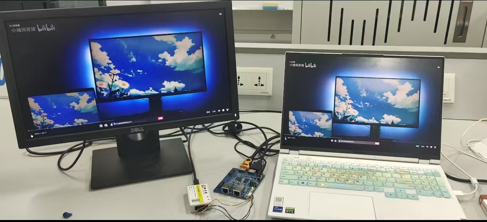

# scale_

这是一个基于纯 Verilog FPGA 的双线性插值视频缩放工程。

项目功能是将 PC 端 HDMI 输入视频通过双线性插值算法进行缩小或放大，再通过 HDMI 输出显示，可以实现任意比例缩放。

## 项目特点

- 基于双线性插值算法实现视频缩放
- PC 端 HDMI 输入，缩放后 HDMI 输出显示
- 缩放模块仅包含 DDR IP
- RAM、FIFO 代码为手写实现
- 模块结构较清晰，较容易移植到其他 FPGA 平台

## 硬件与软件平台

- 硬件平台：易灵思 Ti60F225
- EDA 平台：Efinity

## 项目图片

## 工程下载

完整工程已打包为 `scale_.rar`，请在本仓库的 [Release 页面](https://github.com/taojiawei-sarem/scale_/releases/tag/v1.0.0) 下载。

如果这个项目对你有帮助，欢迎给本仓库点一个 Star 支持一下。
